# Quentin McKay & Matt Garrow - T3A2-A - Full Stack App (Part A)

## Authors

Quentin McKay - [GitHub](https://github.com/quentin-mckay) | [Portfolio](https://www.quentinmckay.dev/) | [LinkedIn](https://www.linkedin.com/in/quentinmckaydev/)

Matt Garrow - [GitHub](https://github.com/mjkgarrow) | [Portfolio](https://matt-garrow.netlify.app/) | [LinkedIn](https://www.linkedin.com/in/matt-garrow/)

## Project links

- [Github repo](https://github.com/Manage-My-Block/StrataSphere-Docs)
- [Project presentation]()
- [Trello board](https://trello.com/b/L4fMRj3x/term-3-full-stack-project)

## Index

- [Description](#description)
- [Purpose](#purpose)
- [Functionality/Features](#functionality--features)
- [Target Audience](#target-audience)
- [Tech Stack](#tech-stack)
- [Dataflow Diagram](#dataflow-diagram)
- [Application Architecture](#architecture-diagram)
- [User Stories](#user-stories)
- [Wireframes](#wireframes)
- [Planning methodology](#trello-board)

## R1 - APP DESCRIPTION
### Description

**_StrataSphere_** is a building management tool that allows Owners Corporation Managers, Owners Committee Members, and Building Members to stay on top of everything happening in their building - from official capital works to who is throwing the next BBQ or block party.

### Purpose

The current problem is that many buildings are managed in an informal way, with committee members messaging and emailing individually with little transparency, while the owners corporation management are unable to collate all the information about the building, as well as lacking their own communication and responsibility transparency. While there exists some forms of management software (such as Trello), these are unequiped for managing a building that needs to conform to state building management codes as well as maintaining building security. This app aims to tackle these issues.

### Functionality & Features

#### Features:
- Public notice board with comments
- Ticket board (similar to todo items), with comments
- Voting mechanism within Tickets
- Meeting scheduler
- Budget tracker
- Authentication and authorisation

#### Functionality
- Admin roles can CRUD users/tickets/posts/votes/meetings/contacts/budget
- Committee member roles can CRUD tickets/posts/comments
- Building member roles can CRUD their own posts/comments

### Target Audience

This is an enterprise-facing application. The application will be provided for internal use by a Owners Corporation Management company that can then allow access to building members. The target audience will be the owners corp management and the owners/occupants of a building. Future updates could allow multiple buildings to be managed through the one account, but for the first version each instance of the app will only manage a single building.

### Tech Stack

This is a MERN application:
- MongoDB: A document-oriented database for storing data.
- ExpressJS: The server framework that manages requests/responses, including the business logic in the back-end of the application.
- React: The front-end framework for building the client-facing views. We have used Vite to build the React scaffolding.
- Node: The JavaScript runtime environment that creates the server that ExpressJS runs on.

Deployment:
- Render: Node/Express server deployment through Render.com
- MongoAtlas: Database stored on MongoDB cloud service, Atlas
- Netlify: React front-end deployed on Netlify

---

## R2 - DATAFLOW DIAGRAM 

Dataflow Diagram:

  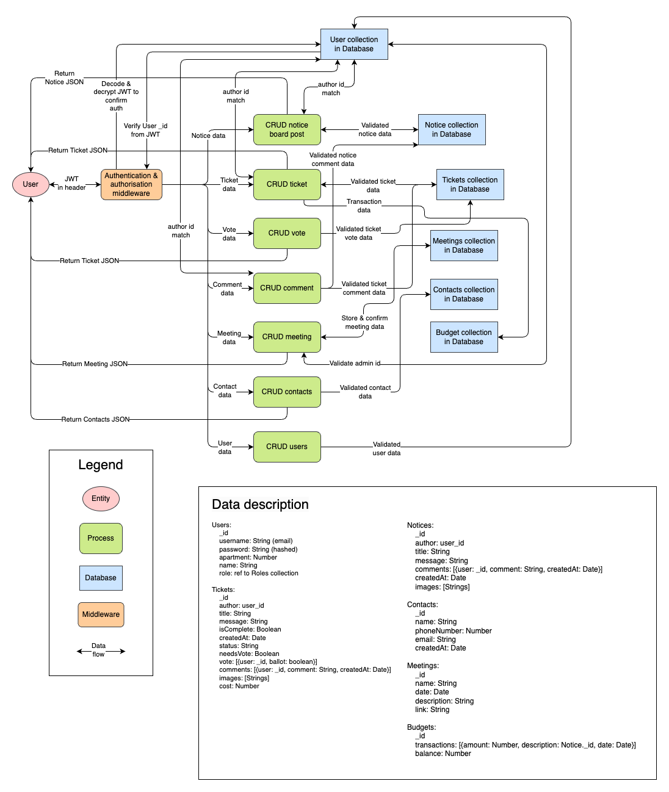

---

## R3 - APPLICATION ARCHITECTURE DIAGRAM 

Application Architecture Diagram:

  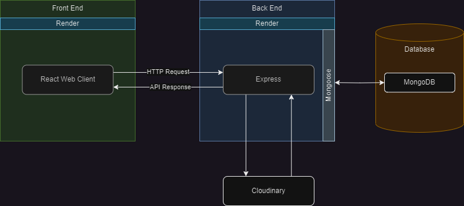

## R4 - USER STORIES 

The app will have 3 types of user:
- #### **Owners Corporation Manager**
    This is an 'admin' role, they can CRUD users/tickets/notice board posts/meetings. They can also create data in the app such as adding contact information for services (plumber, elevator, electricians, etc), adding apartment numbers (to assign to users), approving the Owners Committee members, updating the budget balance. They can call votes, approve votes, and add minutes to meetings.

    Owners Corporation Managers are people who are part of a company that manages buildings to comply with state and national housing laws. Most buildings have Owners Corporation Managers, however it is possible for smaller units to self-manage. Both kinds of manager can use the StrataSphere app.

- #### **Owners Committee Members**
  Owners Committee Members have all the abilities of a standard *Building Member* but can also cast votes when the Owners Corporation Manager calls a vote and CRUD tickets/notice board posts.

  Committee members are a voluntary position in a owners corporation. They are owners of apartments in the building and they can request to join the committee after each Annual General Meeting, which is where Owners Corporation Managers present budget outcomes and owners can voice concerns. It is often the case that each year the committee members will change.

- #### **Building Member**
  This is the standard role in the app. They can CRUD their own notice board posts and comment on posts. They can only read information about committee members, the owners corporation manager, other building members, services contact info, and tickets. They cannot create tickets, that needs to be done by a Owners Committee Member. All Building Member abilities are shared with Owners Committee Members.

  Building members can be owners or occupants of apartments in the building. While similar building management apps restrict users to owners only, StrataSphere allows for a more open environment where renters and other occupants can participate in the building management. However, because this type of user may not be legally entitled to make decisions StrataSphere restricts the role to only the notice board and viewing data for contacts and other users.

#### Owners Corporation Manager User Stories
- "As an Owners Corporation Manager, I want to only allow approved building occupants to access the application, so that we can maintain building security."

- "As an Owners Corporation Manager, I want to be able to CRUD users, so I can make sure the users are approved occupants of the building with the correct contact information."

- "As an Owners Corporation Manager, I want to be able to schedule a meeting with the Owners Committee, so that we can discuss tickets and provide feedback"

- "As an Owners Corporation Manager, I want the ability to call a vote on tickets and approve the vote, so that there is input from the Owners Committee members that is officially recorded."

- "As an Owners Corporation Manager, I want to be able comment on tickets, so that I can provide additional information for committee members and show how the work is progressing."

- "As an Owners Corporation Manager, I want the finalise and close tickets, so that I can show the progress being made and keep the tickets log organised."

- "As an Owners Corporation Manager, I want to be able to moderate the notice board, so that I can keep it organised and remove unwanted posts."

- "As an Owners Corporation Manager, I want to be able to add contact information, so that building occupants can easily access emergency contacts to manage tickets."

- "As an Owners Corporation Manager, I want to be able to approve Owners Committee members, so I can update the roster after each Annual General Meeting."

- "As an Owners Corporation Manager, I want to be able to update the budget, so that I can inform the occupants how much money we have remaining in the budget."

#### Owners Committee Member User Stories

- "As an Owners Committee Member, I want to be able to CRUD tickets for issues in the building, so that I can inform the owners corporation management of repairs/problems."

- "As an Owners Committee Member, I want to be able comment on tickets, so that I can provide additional information for other committee members and owners corp management."

- "As an Owners Committee Member, I want to be able to CRUD posts on the notice board, so that I can have discussions with other building members about topical issues in the building."

- "As an Owners Committee Member, I want to be able to cast votes on tickets, so that I can perform my task as a committee member and approve of any works that need to be done."

#### Building Member User Stories

- "As a building member, I want to be able to see information about committee members, managers, and other building members, so that I have access to contact information and a clear understanding of who is involved in my community."

- "As a building member, I want to be able to see the contact information for building services, so that I know who to contact when necessary."

- "As a building member, I want to be able to be able to create, update, and delete my posts on the notice board, so that I can contribute to notice board posts."

- "As a building member, I want to be able to see basic budget information, so that I understand the current state of the budget to provide context for the meetings."

### User Story first refinement

We added some additional admin abilities to the Committee persona as we felt like they should have similar abilities. The only thing that a committee member can't do is CRUD other users

#### Owners Committee Member User Stories

| **I want to...**              | **So I can...**                                                                                       | **Related Feature**                                       |
| ----------------------------- | ----------------------------------------------------------------------------------------------------- | --------------------------------------------------------- |
| CRUD a ticket                 | inform the owners corporation management of repairs/problems                                          | Create a Ticket if committee member                       |
| Comment on Tickets            | provide additional information for other committee members and owners corp management                 | Ticket commenting if committee member                     |
| Vote on a Ticket              | perform my duty as a committee member and approve of any works                                        | Cast a vote on a Ticket if committee member               |
| CRUD the Notice board         | keep the notices organised and remove unwanted posts, as well as talk about goings-on in the building | CRUD any notices/comments if committee member             |
| Change the status of a Ticket | Start or close a ticket if the work is complete                                                       | Set status and set complete on Ticket if committee member |
| Add a cost to a ticket        | To show how much something cost                                                                       | Set Ticket cost and update Budget if committee member     |
| CRUD a Meeting                | provide feedback to the committee and call an AGM                                                     | CRUD Meetings if committee member                         |
| Call a vote on a Ticket       | Confirm the committee members approve the action required                                             | Call a vote on Ticket if committee member                 |

### User Story final refinement

We have taken the user stories and combined them with specific features. We have also streamlined some of the stories so we have a clearer understanding of how features and UX will interact.

#### Owners Corporation Manager User Stories

| **I want to...**              | **So I can...**                                           | **Related Feature**                            |
| ----------------------------- | --------------------------------------------------------- | ---------------------------------------------- |
| Call a vote on a Ticket       | Confirm the committee members approve the action required | Call a vote on Ticket if admin                 |
| Comment on Tickets            | Provide feedback on the work taken                        | Ticket commenting                              |
| Change the status of a Ticket | Start or close a ticket if the work is complete           | Set status and set complete on Ticket if admin |
| Add a cost to a ticket        | To show how much something cost                           | Set Ticket cost and update Budget if admin     |
| Approve committee memebers    | update the roster after each Annual General Meeting       | CRUD users if admin                            |
| CRUD the Notice board         | keep the notices organised and remove unwanted posts      | CRUD any notices/comments if admin             |
| CRUD a Meeting                | provide feedback to the committee and call an AGM         | CRUD Meetings if admin                         |

#### Owners Committee Member User Stories

| **I want to...**              | **So I can...**                                                                                       | **Related Feature**                                       |
| ----------------------------- | ----------------------------------------------------------------------------------------------------- | --------------------------------------------------------- |
| CRUD a ticket                 | inform the owners corporation management of repairs/problems                                          | Create a Ticket if committee member                       |
| Comment on Tickets            | provide additional information for other committee members and owners corp management                 | Ticket commenting if committee member                     |
| Vote on a Ticket              | perform my duty as a committee member and approve of any works                                        | Cast a vote on a Ticket if committee member               |
| CRUD the Notice board         | keep the notices organised and remove unwanted posts, as well as talk about goings-on in the building | CRUD any notices/comments if committee member             |
| Change the status of a Ticket | Start or close a ticket if the work is complete                                                       | Set status and set complete on Ticket if committee member |
| Add a cost to a ticket        | To show how much something cost                                                                       | Set Ticket cost and update Budget if committee member     |
| CRUD a Meeting                | provide feedback to the committee and call an AGM                                                     | CRUD Meetings if committee member                         |
| Call a vote on a Ticket       | Confirm the committee members approve the action required                                             | Call a vote on Ticket if committee member                 |

#### Building Member User Stories

| **I want to...**                      | **So I can...**                                          | **Related Feature**             |
| ------------------------------------- | -------------------------------------------------------- | ------------------------------- |
| CRUD the Notice board                 | talk about goings-on in the building                     | CRUD their own notices/comments |
| View contact and building member data | know who to contact in an emergency or to discuss issues | View all contacts and users     |
| View budget data                      | understand how my body corp fees are being spent         | View budget and transactions    |

### PART B USER STORIES REVISION

During the course of coding Part B we realised that having multiple roles would limit the usability for first time users, restricting access and preventing features from being used. As a way to make the app more accessible and engaging for all users we merged the three role types into a single role, which has all the permissions available in the app. While this doesn't impact the user stories it does change the way we coded up the features.

---

## R5 - WIREFRAMES 

Wireframes for multiple standard screen sizes, created using industry standard software

Desktop - Dashboard

  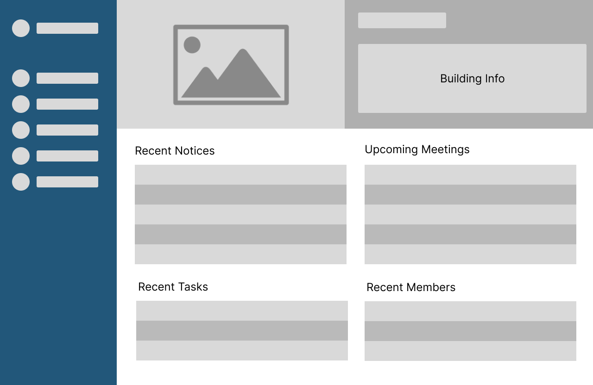

Desktop - Notice Board and Members pages

  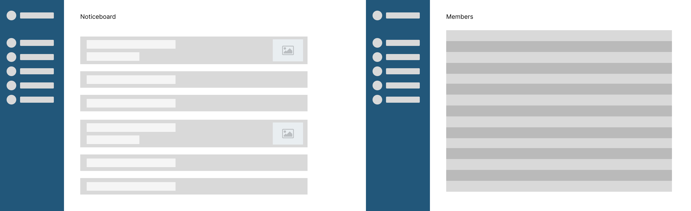

Desktop - Meetings and Task Board pages

  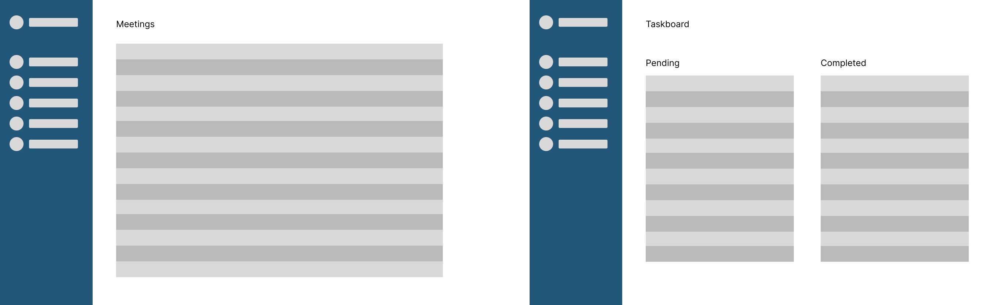

Desktop - Login and Register forms

  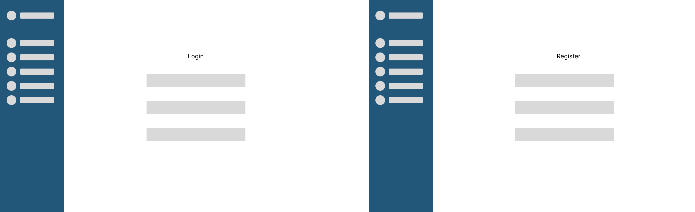

Mobile - Pages

  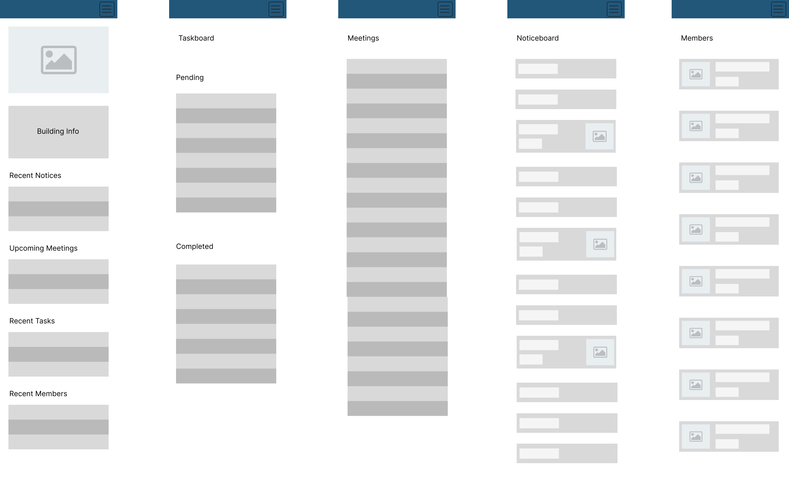

Mobile - Login and Register pages

  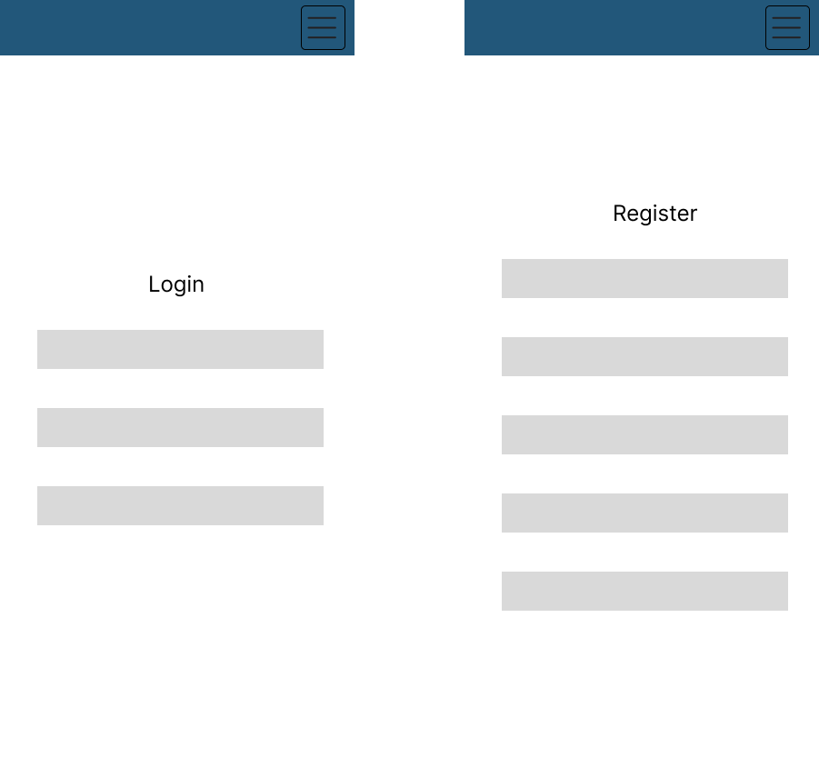

---

## R6 - PLANNING METHODOLOGY 

Tasks are organised using [Trello](https://trello.com/b/L4fMRj3x/term-3-full-stack-project).

For our planning methodology we went with a simplified version of Kanban, while adhering to Agile procedures such as sprints, reviews and definition-of-done. At the start of each sprint we create the tasks, which are broken down into 'cards' and placed in the 'Current Sprint' bin. We then assign the tasks to each team member. Tasks move from left to right as they are completed. We also used a 'blocked' bin, which helps signal when a person is waiting on another piece of work to complete their task.

We used a colour-code system to visually see how long each task is estimated to take. We have estimates from 1 hour to 1 week. We try to limit the cards to a max of 2 days though some cards, like the wireframes, were estimated to take over a week. At the end of each sprint we review the estimates and update expectations based on improved effeciency.

  

Rubric items were also added to the Trello so we can track how the assignment is progressing and to have 'definition of done' for our sprints/cards.

  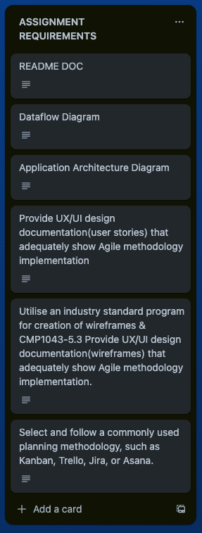

### July 6:

Trello setup and first task assignment. Because we were still new to the project we didn't have accurate estimates on how long each item would take, so we kept the due date and task broad so we could refine it in the next sprint.

  

  

  

### July 7

Matt split his tasks into more manageable cards to maintain a 2-4 hour window for tasks. This kept him more focused and on track, plus it had the added benefit of visualising the burn-down.

  

### July 9

Quentin started work researching the front-end technologies. Quentin also took on the Wireframe work, while Matt took the Dataflow Diagram work.

  

### July 10

Slowly burning down the work. Quentin completed a few of his research tasks.

  

### July 11

Matt did a review and re-work of the dataflow diagram to incorporated some feedback provided.

  

Matt completes his tasks and begins finalising the README document for submission. Quentin still working on Wireframes. Those tasks require a review into thier estimated work time.

  

### July 12

Matt does a review of the User Stories. There was discussion about the level of authorisation given to Committee Member users - the outcome being that they should have the same abilities as an admin but without User CRUD.

  

Wrapping up the last bits of the project. Matt takes on the task of ensuring the readme document is complete and correct.

  

A new item is added to the current sprint - video presentation work.

  

The final piece of the project: getting it ready for submission.

  

# Part B

## R4 - PROJECT MANAGEMENT METHODOLOGY

We continued to use the Trello board from Part A in this assignment, along with the methodology of sprints, kanban, and time estimates.

We generally tried to split the work evenly, though Matt had a preference for back-end work and Quentin for the front-end. Thus we allocated tasks according to each team member's ability. Matt did most of the back-end design, models and testing, while Quentin did most of the UI/UX and querying logic on the front-end. This was a good use of resources as we were able to get a MVP finished within a week.

### July 20

We started the project by describing the project requirements.

  

Then we organised our first sprint - creating the back-end architecture. As mentioned, Matt took on much of the initial model design work.

  

  

### July 22

After creating the basic MVC design pattern, we started to work on authentication and data validation.

  

  

### July 23

After the back-end was mostly complete we started work on the testing campaign. Here we split test-writing between Matt and Quentin.

  

### July 26

## R8 - USER TESTING

### Development testing

We used the `jest` test library, along with `supertest`, and end-to-end user testing to create tests for the application. 

Matt wrote the back-end tests primarily with jest and supplemented with manual API tests. For the manual testing we used the `Thunderclient` VS Code plugin, which is similar to Postman but can run entirely in VS Code.

Here we created an testing environment file to track variables:

  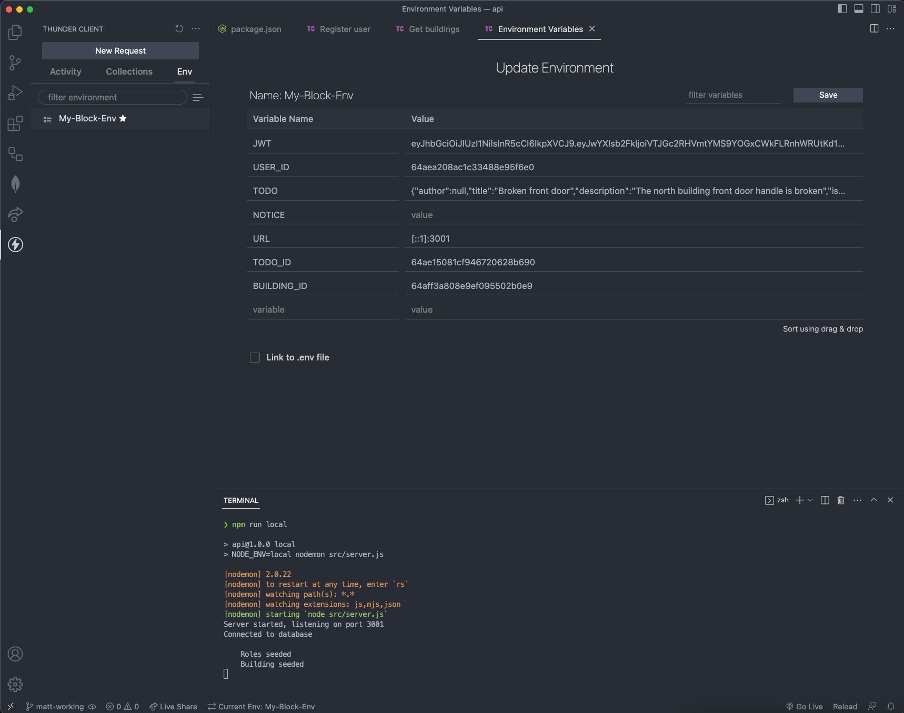

Registering a user:

  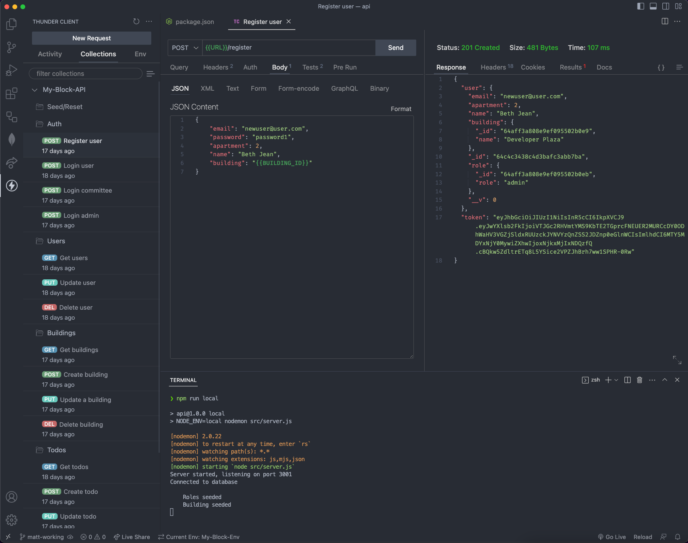

Creating a new building and building manager:

  

The various route tests for each controller:

  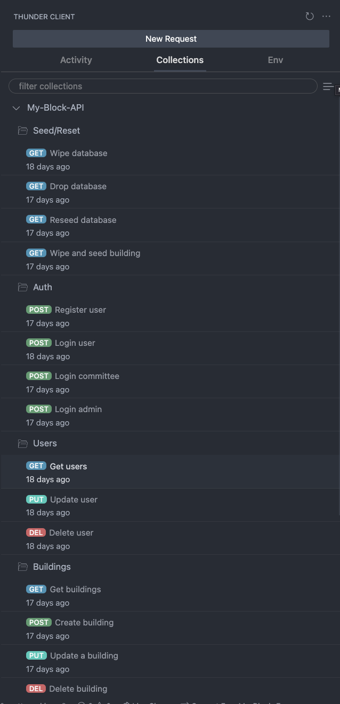

Along with the Thundeclient we also made automated jest tests. Here is part of the test for the Todos route:

  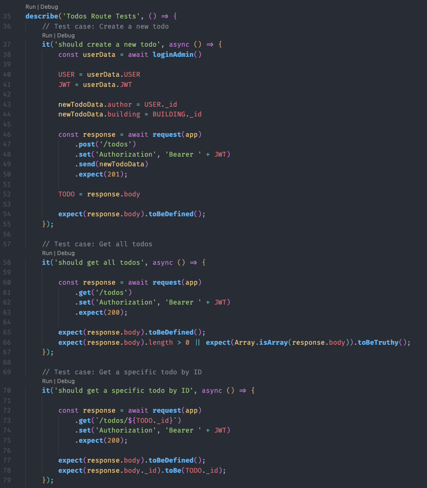

Here is the list of test files:

  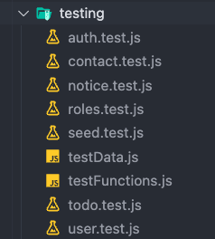

Results of the test campaign:

  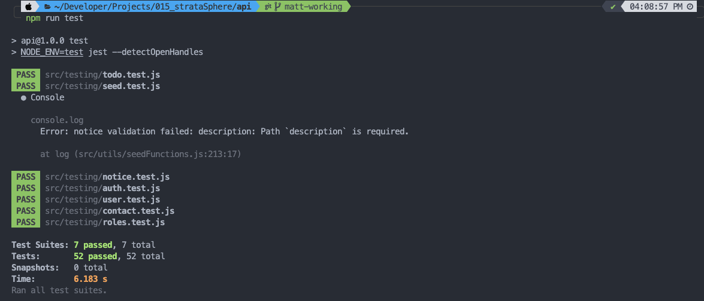

Detailed details of tests:

  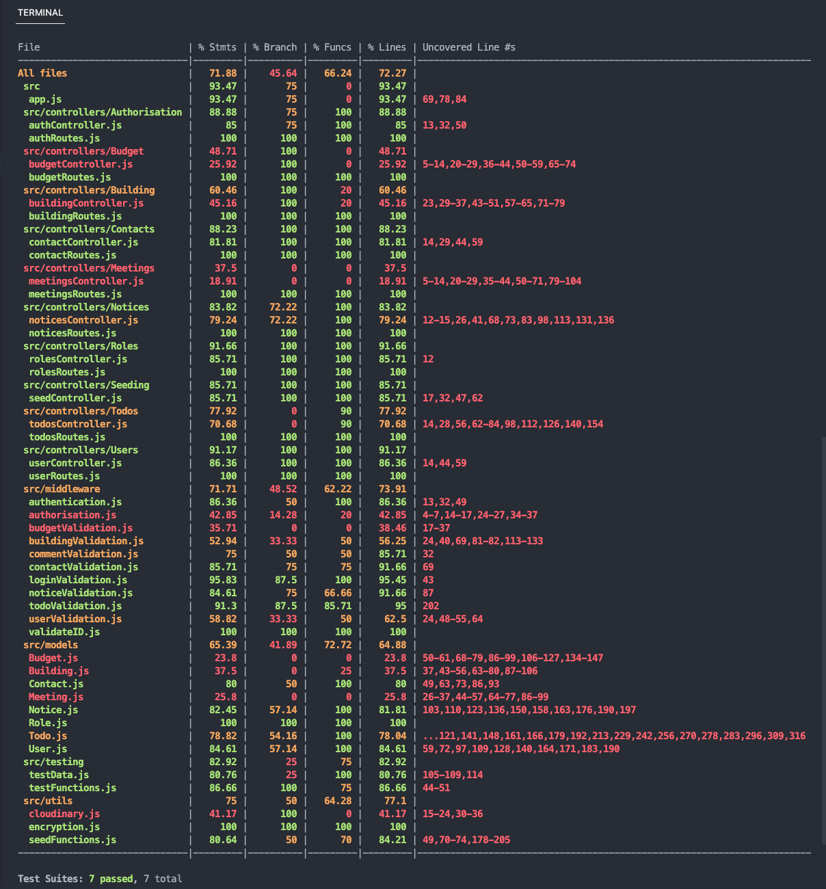

Jest provided us with a coverage report. While we were unable to complete a full test suite for every route, especially the later routes like `/meetings` and the unused `/budgets` feature, we did extensive testing on the core feature routes, with many achieving 100% function coverage.

  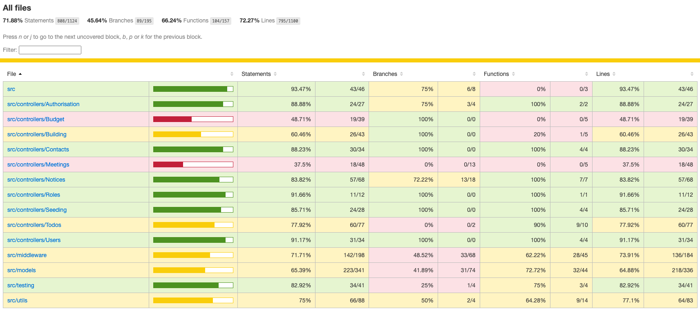

We allowed for the gaps because many of the backend routes are identically to each other, featuring standardise CRUD code throughout the codebase. So be extensively testing the major routes we could be confident the others would work too.

### Production testing

In production we moved from a unit-testing framework into an end-to-end methodology. This means we started to integrate the User Stories into our testing, building tests paired many features together to give us an understanding of how our application would be used in the real world. We ended up merging some of the Stories to streamline the testing and to also display a more natural usage of the app. For clarity, here we changed the `ticket` terminology from Part A to `task`, which is what we called a ticket/todo in the front-end. We settled on these User Stories to base our testings:

| **I want to...**                                        | **So I can...**                                                                                                           | **Related Feature** | **Test**                                                                                                                                 |
| ------------------------------------------------------- | ------------------------------------------------------------------------------------------------------------------------- | ------------------- | ---------------------------------------------------------------------------------------------------------------------------------------- |
| Register to use the app                                 | Use the app.                                                                                                              | User creation       | Create a new user, assign the user a building                                                                                            |
| Login in to the app                                     | Access my saved info and manage my building                                                                               | Authentication      | Using previously registered info, log in to the app                                                                                      |
| Log out of the app                                      | Leave the application so it is secure and no-one else can access it                                                       | Authentication      | Using previously registered info, log in to the app, click 'logout' button to delete JWT from cookie                                     |
| Create a task and write a comment on it                 | Tnform the owners corporation management of repairs/problems                                                              | Task CRUD           | User login, navigate to `Tasks`, use task creation form, submit form, access new task and submit a comment                               |
| Call a vote on a task, submit ballot and close a task   | Confirm the committee members approve the action required and can complete a task                                         | Task CRUD           | Navigate to `Tasks`, open previously created task, click `call vote` button, then cast a vote                                            |
| Drag and drop a task from `Pending` to `Active`         | Move a task into an active status, to tell building members it is being worked on                                         | Task CRUD           | Navigate to `Tasks`, open previously created task, drag and drop task from pending to active droppable space                             |
| Edit a task and delete it                               | Update the info in the task, such as the deadline or other info, and completely remove a task from the history            | Task CRUD           | Navigate to `Tasks`, open previously created task, click `edit` button, change due date, submit edit, then delete task                   |
| Create a notice with an image and write a comment on it | Start a discussion on the building noticeboard where all users can engage, provide a picture to add context to the notice | Notice CRUD         | Navigate to `Notices`, use notice creation form, upload image, submit form, access new notice and submit a comment                       |
| Edit a notice and delete it                             | Change information on the notice, or remove a notice so the noticeboard can remain clear                                  | Notice CRUD         | Navigate to `Notices`, open previously created notice, click `edit` button, change the description, submit edit, then delete notice      |
| Create a meeting and delete it                          | Distribute meeting links and to show the next meeting on the calendar                                                     | Meeting CRUD        | Navigate to `Meetings`, use meeting creation form, add a Zoom link and choose a date, submit form, click delete button to delete meeting |
| Create a contact and delete it                          | Provide helpful contact info for people who can help around building (eg: plumbers, cleaners, etc)                        | Contact CRUD        | Navigate to `Contacts`, use contact creation form, submit form, click delete button to delete contact                                    |
| Edit building info (can't delete building)              | Keep all building information up to date.                                                                                 | Building Update     | Navigate to `Building`, use building update form, change address, submit form, confirm update                                            |

And here are the results of the tests:

  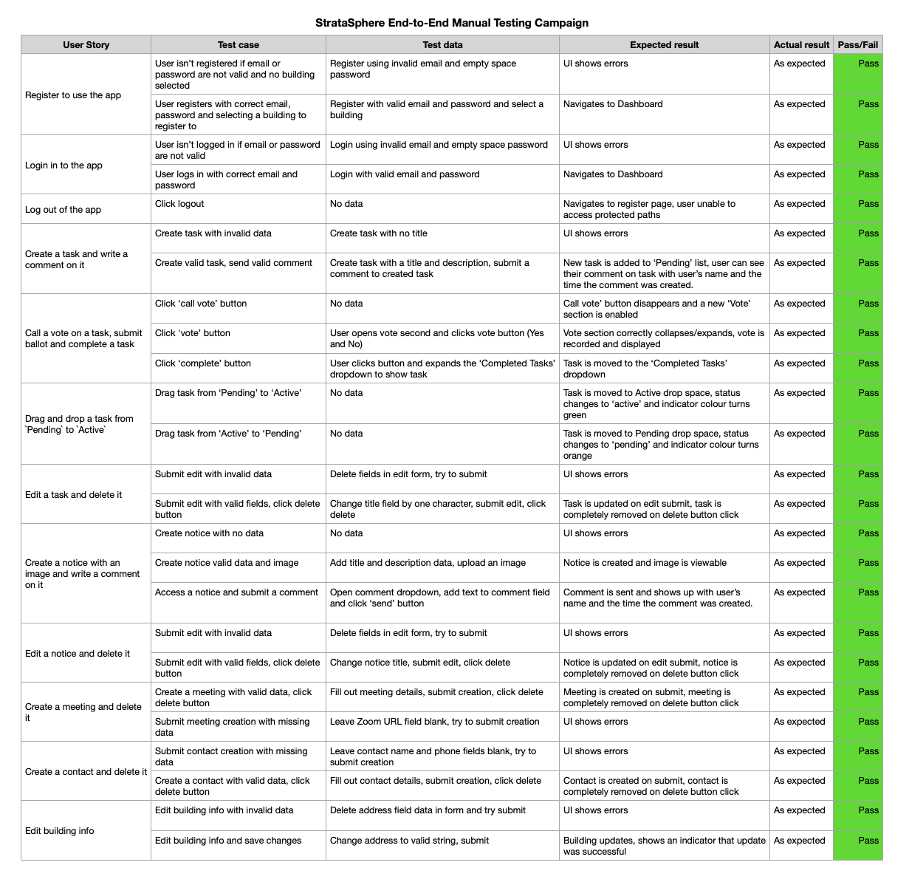

On top of end-to-end tests we also conducted some unit-tests to make sure the components were operating as expected:

